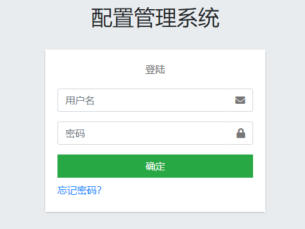
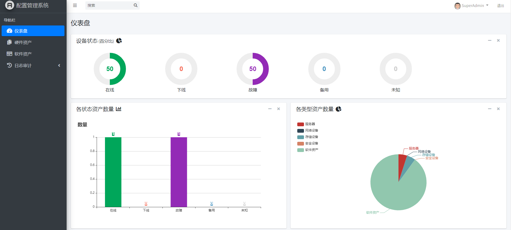
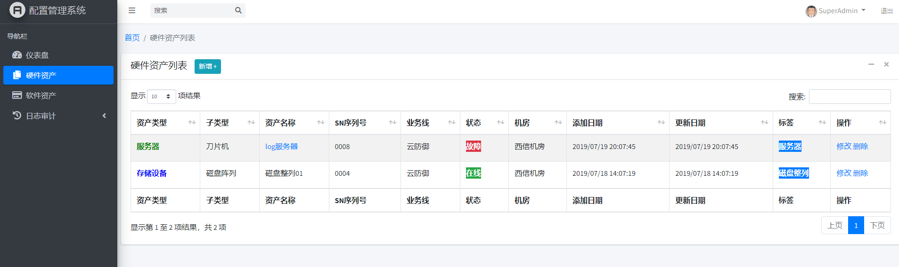
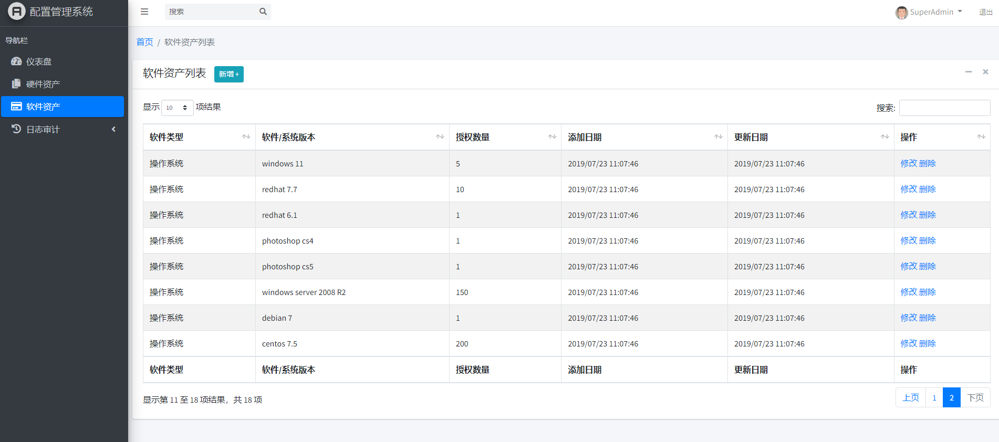
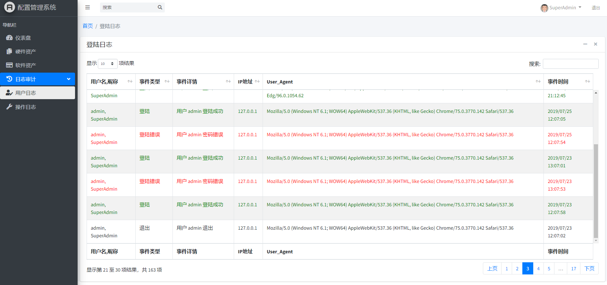
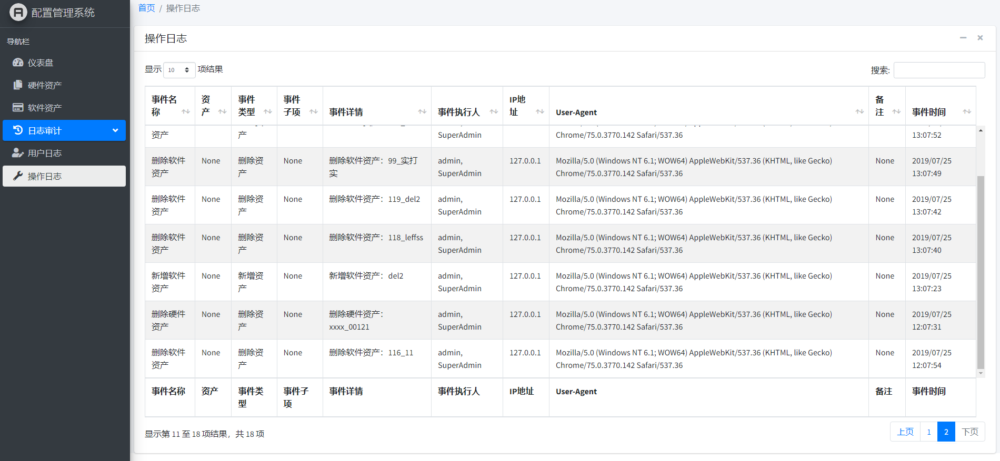

# 1 CMDB System
基于 python 3.7 + django 2.2.3 + AdminLTE-3.0.0-beta.1 实现的配置管理系统，非前后端分离。基于 [刘江老师的教程](http://www.liujiangblog.com/course/django/116) ，练手项目，原教程功能简单，在其基础上修改新增了不少功能，具体见 `screenshots` 文件夹中的效果预览图。目前功能非常不完善，最终期望实现一个完整的运维系统（包含资产管理、批量执行、在线终端等）。


# 2 安装
```bash
# 安装相关库
pip install -r requirements.txt

# 运行
python manage.py runserver

# 运行指定端口
python manage.py runserver 127.0.0.1：8088
```

- 访问首页：http://127.0.0.1:8000
  - 账号： admin     密码：123456
- AdminLTE：[Free Bootstrap Admin Template | AdminLTE.IO](https://adminlte.io/)

# 3 效果













# 3 已实现功能
- [x] dashbord
- [x] 用户登陆
- [ ] 验证码登陆
- [x] 修改密码
- [x] 查看个人信息
- [ ] 新增用户
- [ ] 用户管理
- [ ] 权限管理
- [x] 查看资产列表
- [x] 查看资产详细
- [x] 删除资产
- [ ] 修改资产
- [ ] 新增硬件资产
- [x] 新增软件资产
- [ ] 搜索资产
- [ ] 自动更新资产信息
- [x] 用户日志审计
- [x] 操作日志审计
- [ ] 所有表单数据验证
